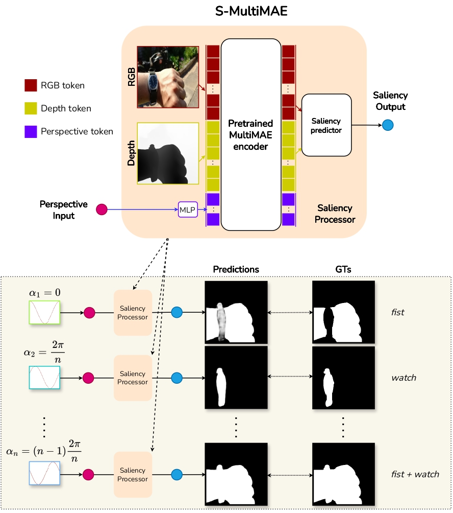

# S-MultiMAE [ICPR-2024]

This repository provides the official implementation of `S-MultiMAE - A Multi-Ground Truth approach for RGB-D Saliency Detection`

Keyword: RGB-D Saliency Detection - Multimodal

_Truong Thinh Huynh Nguyen, Van Linh Pham, Xuan Toan Mai and Tuan Anh Tran_


## Model architecture



## Model weights

| Backbone | #params     | Training paradigm | Weights                                                                                        | Input size |
| -------- | ----------- | ----------------- | ---------------------------------------------------------------------------------------------- | ---------- |
| ViT-L    | 328,318,529 | Multi-GT          | [Download](https://drive.google.com/file/d/1YhAuu3DI2adPLQgbgoSt74ilZbpuKihh/view?usp=sharing) | 224x224    |
| ViT-B    | 107,654,977 | Multi-GT          | [Download](https://drive.google.com/file/d/13Omafif3pvPKgg3Isp_srkHf8CSPx33d/view?usp=sharing) | 224x224    |

## Demo on HuggingFace 🤗

- https://huggingface.co/spaces/RGBD-SOD/S-MultiMAE

| RGB | Depth | Pred 1 | Pred 2 | Pred 3 | Pred 4 |
| --- | --- | --- | --- | --- | --- |
|  |  |  |  |  |  |
|  |  |  |  |  |  |
|  |  |  |  |  |  |
|  |  |  |  |  |  |
|  |  |  |  |  |  |


<!-- 
 -->

## How to run locally

### Create a virtual environment

We recommend using python 3.12 or higher.

```bash
python3.12 -m venv env
source env/bin/activate
pip install -r requirements.txt
```

### Download trained weights

- Download model weights and put it in the folder `weights`. You may also need to download the weights of [DPT model](https://drive.google.com/file/d/1vU4G31_T2PJv1DkA8j-MLXfMjGa7kD3L/view?usp=sharing) (a rgb2depth model). The `weights` folder will look like this:

```bash
├── weights
│       ├── omnidata_rgb2depth_dpt_hybrid.pth
│       ├── s-multimae-cfgv4_0_2006-top1.pth
│       ├── s-multimae-cfgv4_0_2007-top1.pth
```

### Run

- Run streamlit app

```
streamlit run streamlit_apps/app.py --server.port 9113 --browser.gatherUsageStats False --server.fileWatcherType none
```

## Results


### Multi-GT benchmark (which we introduce in this paper)


### Single-GT benchmark (widely used by previous methods)


## Datasets

### COME15K dataset

|                       | 1 GT   | 2 GTs | 3 GTs  | 4 GTs | 5 GTs |
| --------------------- | ------ | ----- | ------ | ----- | ----- |
| COME8K (8025 samples) | 77.61% | 1.71% | 18.28% | 2.24% | 0.16% |
| COME-E (4600 samples) | 70.5%  | 1.87% | 21.15% | 5.70% | 0.78% |
| COME8K (3000 samples) | 62.3%  | 2.00% | 25.63% | 8.37% | 1.70% |

```
@inproceedings{cascaded_rgbd_sod,
  title={RGB-D Saliency Detection via Cascaded Mutual Information Minimization},
  author={Zhang, Jing and Fan, Deng-Ping and Dai, Yuchao and Yu, Xin and Zhong, Yiran and Barnes, Nick and Shao, Ling},
  booktitle={International Conference on Computer Vision (ICCV)},
  year={2021}
}
```

## Acknowledgements

S-MultiMAE is build on top of [MultiMAE](https://github.com/EPFL-VILAB/MultiMAE). We kindly thank the authors for releasing their code.

```bib
@article{bachmann2022multimae,
  author    = {Roman Bachmann and David Mizrahi and Andrei Atanov and Amir Zamir},
  title     = {{MultiMAE}: Multi-modal Multi-task Masked Autoencoders},
  booktitle = {European Conference on Computer Vision},
  year      = {2022},
}
```

## References

All references are cited in these files:

- [Datasets](./docs/references/Dataset.bib)
- [SOTAs](./docs/references/SOTAs.bib)
- [Others](./docs/references/References.bib)
